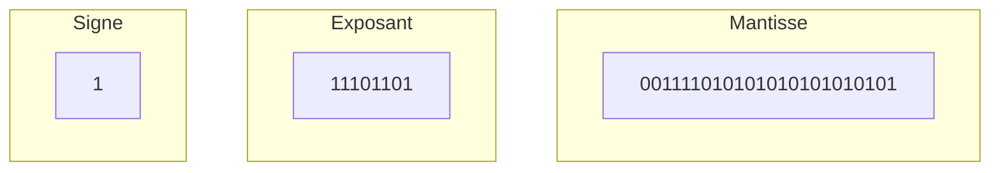

**Cours liés :**
- [[1. La numération actuelle]]

Le codage des nombres flottants (également appelé "représentation de virgule flottante") est une façon de représenter des nombres décimaux en utilisant des chiffres binaires. Il est largement utilisé en informatique pour représenter et manipuler des nombres réels.

Il existe plusieurs normes pour le codage des nombres flottants, comme le format IEEE 754, qui est la norme la plus couramment utilisée. Selon la norme IEEE 754, un nombre flottant est représenté par un nombre binaire composé de trois parties :

1.  Un bit de signe qui indique si le nombre est positif ou négatif.
2.  Un exposant codé en binaire qui indique la position du point décimal par rapport à l'unité.
3.  Une fraction codée en binaire (appelée Mantisse) qui indique la valeur absolue du nombre.

Voici comment le codage d'un nombre flottant en binaire peut être effectué selon la norme IEEE 754 :

>[!help] Comment faire ? 
> 
>1.  On commence par déterminer le bit de signe du nombre. Si le nombre est positif, le bit de signe est 0, et s'il est négatif, le bit de signe est 1. 
>   
> 2.  On calcule la valeur absolue du nombre et on la code en binaire.
> 3.  On détermine la position du point décimal par rapport à l'unité en comptant le nombre de déplacements nécessaires pour le déplacer à gauche ou à droite de l'unité. Si le point décimal doit être déplacé à gauche de l'unité, l'exposant est positif, et s'il doit être déplacé à droite de l'unité, l'exposant est négatif.
> 4.  On code l'exposant en binaire en utilisant le nombre de chiffres binaires nécessaire. Selon la norme IEEE 754, l'exposant est codé sur 8 ou 11 chiffres binaires, selon le nombre de chiffres binaires utilisés pour représenter la fraction.
> 5.  On ajoute le bit de signe, l'exposant codé en binaire et la fraction codée en binaire pour obtenir le nombre flottant complet.

Il est important de noter que le codage des nombres flottants en binaire peut entraîner des erreurs de précision en raison de la limitation du nombre de chiffres binaires utilisés pour représenter la fraction. Cela peut conduire à des approximations lors de l'utilisation de nombres flottants en informatique, notamment lors de l'exécution de calculs mathématiques complexes.

**Cours à voir :**
- [[1.2.1 Les variables]]