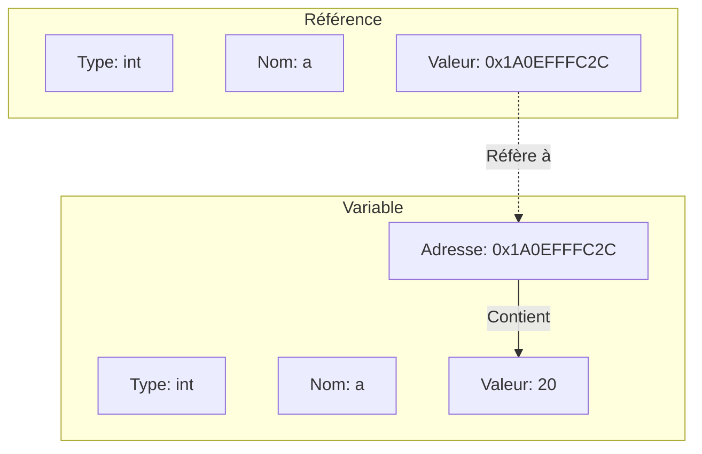
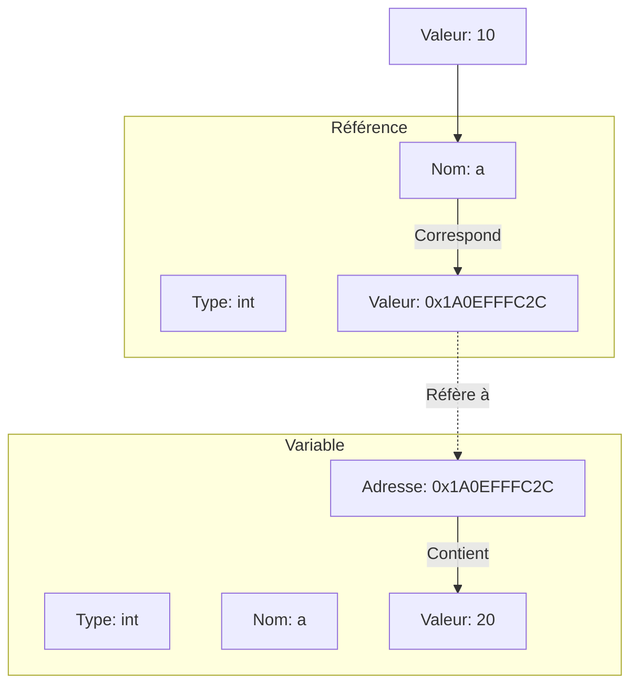
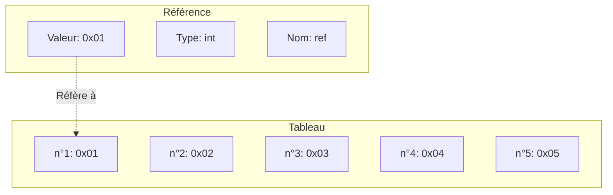

**Cours liés :**
- [[1.4.2 Types de données]]
- [[1.2.1 Les variables]]

Les références en C++ sont des variables qui permettent de faire référence à un autre objet. Elles sont déclarées en utilisant l'opérateur `&` suivi du type de l'objet auquel la référence fait référence. Voici comment déclarer une référence en C++ :

```cpp
type &nom_référence = nom_objet;
```

Par exemple, pour déclarer une référence `x` qui fait référence à un entier `a`, on écrirait :

```cpp
int a = 20;
int &x = a;
```

Le résultat des instructions ci-dessus peuvent être représentées avec le schéma suivant : 



Il est important de noter que la référence doit être initialisée lors de sa déclaration, et qu'une fois initialisée, elle ne peut plus être modifiée pour faire référence à un autre objet.

Une fois qu'une référence a été déclarée, on peut utiliser son nom comme s'il s'agissait de l'objet auquel elle fait référence. Par exemple :

```cpp
int a = 20;
int &x = a;

x = 10; // Equivalent à a = 10; 

cout << x; // Equivalent à cout << a;
```

Les instructions ci-dessus correspondent donc au schéma suivant : 



Il est possible de déclarer une référence à n'importe quel type de données en C++, y compris les types de données complexes tels que les [[1.14.1 Les enregistrements (struct, enum)|structure]] et les [[1.13.1 Les tableaux|tableaux]].

Voici un exemple montrant comment déclarer et utiliser une référence à une [[1.14.1 Les enregistrements (struct, enum)|structure]] en C++ :

```cpp
#include <iostream>
#include <string>

using namespace std;

// Déclaration de la structure Personne
struct Personne {
  string nom;
  string prenom;
  int age;
};

int main() {
  // Déclaration et initialisation d'une variable de type Personne
  Personne personne1 = {"Dupont", "Jean", 30};

  // Déclaration d'une référence à la variable personne1
  Personne &personne2 = personne1;

  // Modification de la valeur de la référence
  personne2.nom = "Durand";

  // Affichage des valeurs de la structure
  cout << "Nom : " << personne1.nom << endl;
  cout << "Prénom : " << personne1.prenom << endl;
  cout << "Age : " << personne1.age << endl;

  return 0;
}
```

Ce code affichera le contenu de la structure `personne1` sous la forme suivante :

```
Nom : Durand
Prénom : Jean
Age : 30
```

## Attention, le cas des références sur tableau : 

Lorsqu'on utilise une référence avec un tableau, la référence fait en réalité référence au premier élément du [[1.13.1 Les tableaux|tableau]]. Par exemple, voici comment déclarer une référence à un [[1.13.1 Les tableaux|tableau]] d'entiers :

```cpp
int tableau[5] = {1, 2, 3, 4, 5};
int &ref = tableau[0];
```

Ce qui revient se représenterait de la façon suivante :



Dans ce cas, la référence `ref` fait référence au premier élément du tableau, soit l'entier `1`. Si on modifie la valeur de la référence, la valeur de l'élément du tableau sera également modifiée :

```cpp
int tableau[5] = {1, 2, 3, 4, 5};
int &ref = tableau[0];

ref = 10;
cout << tableau[0]; // Affiche 10
```

**Cours à voir :**
- [[1.16 Les pointeurs]]