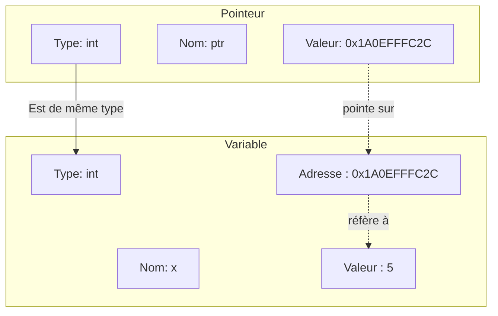
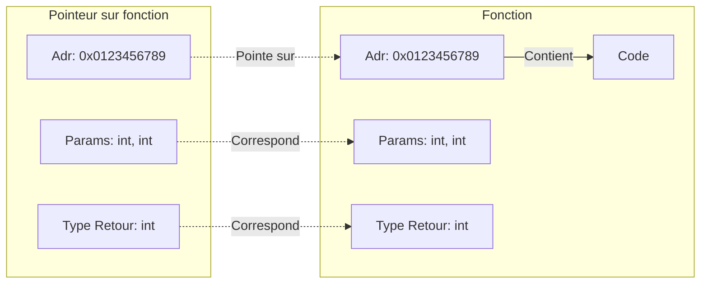

**Cours liés :**
- [[1.2.1 Les variables]]
- [[1.15. Les références]]

# Les pointeurs sur [[1.2.1 Les variables|variable]]

Un pointeur est une [[1.2.1 Les variables|variable]] qui contient l'adresse d'une autre [[1.2.1 Les variables|variable]] en mémoire. Ils permettent de manipuler directement la mémoire et sont souvent utilisés pour passer des arguments par référence à des fonctions et pour créer des [[1.13.1 Les tableaux|tableaux]] dynamiques.

## Fonctionnement en mémoire

En C++, chaque [[1.2.1 Les variables|variable]] a une adresse en mémoire qui lui est unique et qui correspond à l'emplacement où la valeur de cette [[1.2.1 Les variables|variable]] est stockée. Par exemple, si nous avons une [[1.2.1 Les variables|variable]] entière `x` et que nous souhaitons connaître son adresse en mémoire, nous pouvons utiliser l'opérateur `&`:

```cpp
int x = 5;
std::cout << &x << std::endl;
```

Cela affichera l'adresse de `x` en mémoire, sous forme d'un nombre hexadécimal.

Un pointeur est une [[1.2.1 Les variables|variable]] qui contient l'adresse d'une autre [[1.2.1 Les variables|variable]] en mémoire. Pour déclarer un pointeur, nous devons indiquer le type de la [[1.2.1 Les variables|variable]] à laquelle il pointe, suivi de l'opérateur `*`. Par exemple, pour déclarer un pointeur sur une [[1.2.1 Les variables|variable]] entière, nous écrirons:

```cpp
int *ptr;
```

Ici, `ptr` est un pointeur sur une [[1.2.1 Les variables|variable]] entière.

La notion de pointeur de l'exemple ci-dessus peut être résumée avec le schéma suivant :



## Initialisation et affectation d'un pointeur

Pour initialiser un pointeur, nous devons lui assigner l'adresse d'une [[1.2.1 Les variables|variable]]. Pour ce faire, nous utilisons l'opérateur `&` pour récupérer l'adresse de la [[1.2.1 Les variables|variable]] et l'affectons au pointeur. Par exemple:

```cpp
int x = 5;
int *ptr = &x;
```

Ici, nous avons déclaré et initialisé `ptr` avec l'adresse de `x`. Nous pouvons maintenant utiliser `ptr` pour accéder et manipuler la valeur de `x`.

## Modification de la [[1.2.1 Les variables|variable]] à l'aide du pointeur

Pour accéder à la valeur de la [[1.2.1 Les variables|variable]] pointée par un pointeur, nous devons utiliser l'opérateur de déréférencement `*`. Par exemple :

```cpp
int x = 5;
int *ptr = &x;

std::cout << *ptr << std::endl; // affiche 5
```

Nous pouvons également utiliser l'opérateur de déréférencement pour modifier la valeur de la [[1.2.1 Les variables|variable]] pointée :

```cpp
int x = 5;
int *ptr = &x;

*ptr = 10; // modifie la valeur de x
std::cout << x << std::endl; // affiche 10
```

# Les pointeurs sur fonction

Les pointeurs sur fonction sont des pointeurs qui pointent vers une fonction plutôt qu'une [[1.2.1 Les variables|variable]]. Ils permettent de stocker l'adresse d'une fonction et de l'appeler comme une [[1.2.1 Les variables|variable]].

Voici comment déclarer et utiliser un pointeur sur fonction en C++:

```cpp
#include <iostream>

// Déclaration de la fonction
int addition(int a, int b) {
	return a + b;
}

int main() {
	// Déclaration du pointeur sur fonction
	int (*ptr)(int, int) = &addition;
	
	// Appel de la fonction via le pointeur
	int result = (*ptr)(10, 20);
	std::cout << result << std::endl; // affiche 30
	
	return 0;
}
```

Ici, nous avons déclaré un pointeur sur fonction `ptr` qui pointe vers la fonction `addition`. Nous pouvons appeler la fonction en utilisant l'opérateur de déréférencement `*` comme pour n'importe quel autre pointeur.

Ceci peut se résumer par le schéma suivant : 



Il est également possible de déclarer un pointeur sur fonction sans utiliser l'opérateur de déréférencement, en utilisant la syntaxe suivante :

```cpp
int (*ptr)(int, int) = addition;
int result = ptr(10, 20);
```

Dans ce cas, nous n'avons **pas besoin** d'utiliser l'opérateur de déréférencement pour appeler la fonction via le pointeur.

Les **pointeurs** **sur** **fonction** sont souvent **utilisés** pour passer des **fonctions** en tant qu'**arguments de fonctions**, ce qui permet de créer des **fonctions génériques** qui peuvent être utilisées avec différentes fonctions spécifiques en fonction des besoins. 

C'est le cas par exemple lorsqu'on souhaite intégrer un **plug-in** dans un programme. Une fonction principale du plug-in est **passée en paramètre via un pointeur**, ce qui lui permettra d'**être exécutée sans pour autant connaître son contenu.**

## Les [[1.13.1 Les tableaux|tableaux]] de pointeurs sur fonction 

Un tableau de pointeurs sur fonction est un tableau qui contient des pointeurs sur des fonctions. Il est possible de déclarer et d'utiliser un tableau de pointeurs sur fonction de la même manière que n'importe quel autre tableau en C++.

Voici un exemple de déclaration et d'utilisation d'un tableau de pointeurs sur fonction:

```cpp
#include <iostream>

// Déclaration de trois fonctions
int addition(int a, int b) {
	return a + b;
}

int soustraction(int a, int b) {
	return a - b;
}

int multiplication(int a, int b) {
	return a * b;
}

int main() {
	// Déclaration du tableau de pointeurs sur fonction
	int (*operations[3])(int, int) = {addition, soustraction, multiplication};
	
	// Appel des fonctions via le tableau de pointeurs
	int result1 = operations[0](10, 20);
	std::cout << result1 << std::endl; // affiche 30
	
	int result2 = operations[1](10, 20);
	std::cout << result2 << std::endl; // affiche -10
	
	int result3 = operations[2](10, 20);
	std::cout << result3 << std::endl; // affiche 200
	
	return 0;
}
```

Ici, nous avons déclaré un tableau de pointeurs sur fonction `operations` qui contient les adresses de trois fonctions différentes. Nous pouvons appeler ces fonctions en utilisant les indices du tableau comme s'il s'agissait de [[1.2.1 Les variables|variables]] normales.

Il est également possible de déclarer un tableau de pointeurs sur fonction en utilisant la syntaxe suivante:

```cpp
int (*operations[])(int, int) = {addition, soustraction, multiplication};
```

Dans ce cas, nous n'avons pas besoin de spécifier la taille du tableau, car elle est déterminée par le nombre d'éléments initialisés. Cependant, il est recommandé de toujours spécifier la taille du tableau pour éviter les erreurs de débordement de mémoire.

**Cours à voir :**
- [[2.1. Les fonctions en général]]
- [[4.2. La notion Classe-Objet]]