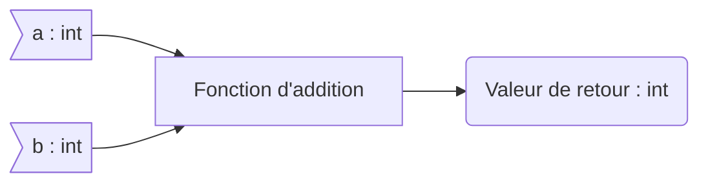

**Cours liés :**
- [[2.0 Les variables]]
- [[4. Types de données]]

Une fonction est un bloc de code qui effectue une tâche spécifique et peut être appelé à plusieurs endroits dans un programme. Les fonctions permettent de structurer et de modulariser le code en décomposant un programme en différentes parties plus faciles à gérer et à maintenir.

Voici la syntaxe de base pour déclarer une fonction en C++:

```cpp
// Déclaration de la fonction
type nom_fonction(liste_paramètres) {
  // Corps de la fonction
  // ...
}
```

Ici, `type` est le type de retour de la fonction (c'est-à-dire la valeur qu'elle renvoie lorsqu'elle est appelée), `nom_fonction` est le nom de la fonction et `liste_paramètres` est la liste des paramètres de la fonction (c'est-à-dire les valeurs qu'elle prend en entrée).

Voici un exemple de fonction qui prend deux entiers en entrée et renvoie leur somme :

> En mathématiques, la fonction $addition(a,b)$ définie telle que :
 >$$
\begin{matrix}
	&\mathbb{Z}^2     &\rightarrow  &\mathbb{Z}\\
	&addition(a,b)  & =           &a+b       \\
\end{matrix}
$$
> Ou pour les plus rigoureux d'entre nous : 
>$$
\begin{matrix}
	&\forall{a}\in\mathbb{Z},\forall{b}\in\mathbb{Z} : (a,b) = \mathbb{Z}^2     &\rightarrow  &\mathbb{Z}\\
	&addition(a,b)  & =           &a+b       \\
\end{matrix}
$$

Cette fonction dispose de plusieurs particularités nécessaires à son écriture dans le programme :

- Elle dipose de deux entiers(`int`) $a$ et $b$ en arguments
- Elle renvoie une valeur entière(`int`)

Ceci donne lieu au schéma de fonction suivant : 



```cpp
#include <iostream>

// Déclaration de la fonction
int addition(int a, int b) {
  // Corps de la fonction
  return a + b;
}

int main() {
  // Appel de la fonction
  int result = addition(10, 20);
  std::cout << result << std::endl; // affiche 30

  return 0;
}
```

Ici, nous avons déclaré une fonction `addition` qui prend deux entiers `a` et `b` en entrée et renvoie leur somme. Nous avons appelé cette fonction dans la fonction `main` en lui passant deux entiers en argument et avons affiché le résultat à l'aide de la fonction `cout`

## Les fonctions dites "procédures"

Les procédures sont des fonctions qui ne renvoient aucune valeur. Elles sont utilisées pour effectuer une tâche spécifique, mais ne renvoient pas de valeur à l'appelant.

Voici comment déclarer et utiliser une procédure en C++ :

```cpp
#include <iostream>

// Déclaration de la procédure
void afficher_message() {
  std::cout << "Bonjour !" << std::endl;
}

int main() {
  // Appel de la procédure
  afficher_message(); // affiche "Bonjour !"

  return 0;
}

```

Ici, nous avons déclaré une procédure `afficher_message` qui affiche un message à l'écran. Comme elle ne renvoie aucune valeur, nous avons déclaré son type de retour comme `void` (ce qui signifie "vide"). Nous avons appelé cette procédure dans la fonction `main` en utilisant son nom et en lui passant aucun argument.

Les procédures sont souvent utilisées pour effectuer des tâches simples qui ne nécessitent pas de valeur de retour, comme afficher un message à l'écran ou lire une entrée utilisateur. Elles sont également utilisées pour passer des paramètres par référence à une fonction, ce qui permet de modifier directement la valeur d'une variable dans la fonction appelante.

Voici un exemple de procédure qui prend un entier en entrée et le modifie :

```cpp
#include <iostream>

// Déclaration de la procédure
void doubler(int &x) {
  x *= 2;
}

int main() {
  int n = 10;
  std::cout << "n = " << n << std::endl; // affiche "n = 10"

  // Appel de la procédure
  doubler(n);
  std::cout << "n = " << n << std::endl; // affiche "n = 20"

  return 0;
}
```

Ici, nous avons déclaré une procédure `doubler` qui prend un entier `x` en entrée et le multiplie par 2. Nous avons appelé cette procédure dans la fonction `main` en lui passant l'entier `n` en argument. Comme nous avons passé `n` par référence à la procédure (en utilisant l'opérateur `&`), la valeur de `n` est modifiée directement dans la fonction `main`, ce qui permet de l'afficher comme étant égal à 20 à la fin de l'exécution.

**Cours à voir :**
- [[2. Les signatures de fonction (prototypes)]]
- [[3. La surcharge de fonction]]