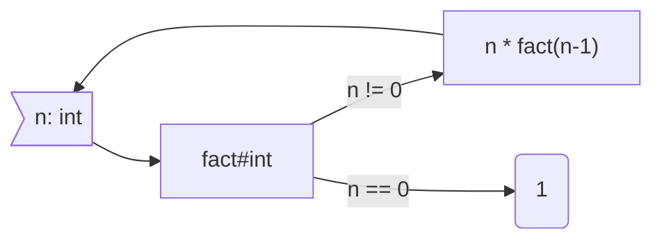

**Cours liés :**
- [[2.1. Les fonctions en général]]

La récursivité en C++ est une technique de programmation qui consiste à définir une fonction qui s'appelle elle-même de manière répétée jusqu'à ce qu'une condition prédéterminée soit remplie. Elle peut être utilisée pour résoudre des problèmes complexes en les divisant en sous-problèmes plus simples et en les résolvant de manière récursive.

Voici un exemple simple de fonction récursive en C++ qui calcule la factorielle d'un entier :

En mathématiques, la fonction factorielle est écrite telle que : 
$$
\begin{matrix}
& \mathbb{N}   & \rightarrow & \mathbb{N} \\
& fact(n) = n! & = & (n)\times(n-1)\times(n-2)\times{...}\times3\times2\times1 \\
\end{matrix}
$$

Ou pour les plus rigoureux d'entre nous :  
$$
\begin{matrix}
	& \mathbb{N}   & \rightarrow & \mathbb{N} \\
	& fact(n)      & =           &\prod_{i=1}^n i\\
\end{matrix}
$$
Exemple avec $fact(5) = 5!$ 
$$
	fact(5) = 5! = 5 \times 4 \times 3 \times 2 \times 1 = 120
$$

La logique de la récursivité dans la fonction factorielle est la suivante : 



```cpp
int factorial(int n)
{
	if (n == 0)
	{
	    return 1;
	} 
	else 
	{
	    return n * factorial(n - 1);
	}
}
```

Dans cet exemple, la fonction `factorial` s'appelle elle-même de manière récursive avec un argument de `n - 1` jusqu'à ce que `n` atteigne 0, moment où la récursion s'arrête et où la fonction renvoie 1.

Il est important de noter que chaque appel récursif crée une nouvelle entrée sur la pile d'appels de fonction, ce qui peut rapidement mener à une utilisation importante de la mémoire si la récursion est trop profonde. Pour éviter cela, il est recommandé de définir une condition d'arrêt pour la récursion afin de limiter sa profondeur.