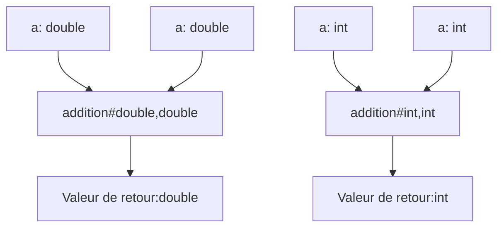

**Cours liés :**
- [[1. Les fonctions en général]]
- [[2. Les signatures de fonction (prototypes)]]

La surcharge de fonction est un concept en C++ qui permet de déclarer plusieurs fonctions avec le même nom, mais avec des signatures de fonction différentes. Une signature de fonction est la combinaison du nom de la fonction, du type de retour et de la liste de paramètres.

Prenons comme exemple une fonction addition qui pourrait traiter des `int` ou des `double` :

> En mathématique, la fonction $addition(a,b)$ serait définie de $\mathbb{N} \rightarrow \mathbb{N}$ 
> Mais elle serait aussi définie de $\mathbb{R} \rightarrow \mathbb{R}$ avec la même opération : 
$$addition(a,b) = a + b$$

Le type du résultat dépendrait alors du type des valeurs en entrée : 



Voici comment déclarer et utiliser la surcharge de fonction en C++:

```cpp
#include <iostream>

// Déclaration de la première fonction
int addition(int a, int b) {
  return a + b;
}

// Déclaration de la seconde fonction
double addition(double a, double b) {
  return a + b;
}

int main() {
  // Appel de la première fonction
  int result1 = addition(10, 20);
  std::cout << result1 << std::endl; // affiche 30

  // Appel de la seconde fonction
  double result2 = addition(10.5, 20.5);
  std::cout << result2 << std::endl; // affiche 31

  return 0;
}
```
