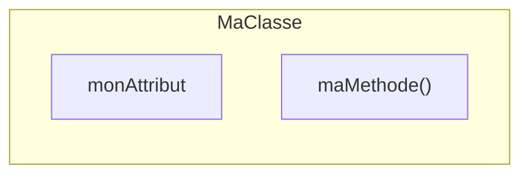
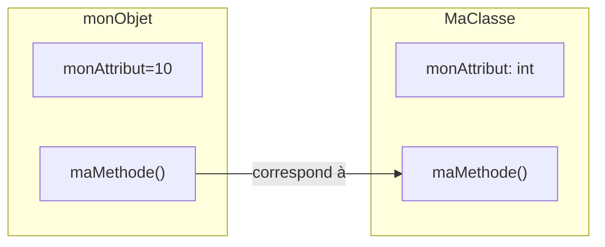

**Cours liés :**
- [[2.0 Les variables]]
- [[1. Les fonctions en général]]
- [[1. La P.O.O en général]]

En C++, les classes et les objets sont les principaux éléments de la POO. Une classe est un modèle pour créer des objets, tandis qu'un objet est une instance d'une classe.

Voici comment déclarer une classe en C++ :

```cpp
class MaClasse {
public:
  // Attributs et méthodes de la classe
};
```

Les attributs représentent les caractéristiques de l'objet, tandis que les méthodes sont les comportements de l'objet.

Voici comment déclarer un attribut et une méthode dans une classe :

```cpp
class MaClasse {
public:
  int monAttribut; // Attribut de type int
  void maMethode(); // Méthode sans paramètres ni valeur de retour
};
```

Ce qui revient à créer le modèle suivant : 




Pour utiliser une classe, vous devez créer un objet de cette classe. Voici comment créer un objet en C++ :

```cpp
MaClasse monObjet; // Création de l'objet
```

Ce qui revient a créer un objet `monObjet` suivant le modèle : 



Pour accéder aux attributs et aux méthodes de l'objet, vous devez utiliser l'opérateur de résolution de portée "." :

```cpp
monObjet.monAttribut = 10; // Affectation de la valeur 10 à l'attribut
monObjet.maMethode(); // Appel de la méthode
```

Voici un exemple complet de classe et d'objet en C++ :

```cpp
#include <iostream>

using namespace std;

// Déclaration de la classe
class Compteur {
public:
  int valeur; // Attribut de type int
  void incr(); // Méthode sans paramètres ni valeur de retour
};

// Définition de la méthode
void Compteur::incr() {
  valeur++;
}

int main() {
  // Création de l'objet
  Compteur monCompteur;
  
  // Utilisation de l'objet
  monCompteur.valeur = 0; // Affectation de la valeur 0 à l'attribut
  monCompteur.incr(); // Appel de la méthode
  
  cout << monCompteur.valeur << endl; // Affichage de la valeur de l'attribut
  
  return 0;
}
```

Ce programme affiche 1 à l'écran, car la méthode `incr` incrémente la valeur de l'**attribut** `valeur` de l'objet `monCompteur`.

## Le constructeur et le destructeur d'objet

Il est également possible de déclarer des constructeurs et des destructeurs dans une classe. Un constructeur est une méthode qui est appelée lors de la création d'un objet, tandis qu'un destructeur est une méthode qui est appelée lorsque l'objet est détruit.

Voici comment déclarer un constructeur et un destructeur dans une classe :

```cpp
class MaClasse {
public:
  MaClasse(); // Constructeur sans paramètres
  ~MaClasse(); // Destructeur sans paramètres ni valeur de retour
};
```

Voici comment définir un **constructeur** et un **destructeur** dans une classe :

```cpp
MaClasse::MaClasse() {
  // Initialisation des attributs de l'objet
}

MaClasse::~MaClasse() {
  // Nettoyage des ressources utilisées par l'objet
}
```

### Le constructeur : 

Un constructeur en C++ est une fonction spéciale qui est appelée lorsqu'un objet de la classe est créé. Il a le même nom que la classe et n'a pas de type de retour (ni même `void`). Les constructeurs sont utilisés pour initialiser les variables d'instance de l'objet et pour effectuer d'autres opérations nécessaires pour créer et initialiser correctement l'objet.

Voici un exemple de définition d'un constructeur pour une classe `Person` qui prend un nom en argument et l'utilise pour initialiser la variable d'instance `name` de l'objet:

```cpp
class Person {
public:
    Person(std::string name) {
        this->name = name;
    }

private:
    std::string name;
};
```

Pour utiliser ce constructeur pour créer un nouvel objet `Person`, vous pouvez utiliser le mot-clé `new` suivi du nom de la classe et des parenthèses contenant les arguments appropriés:

```cpp
Person *p = new Person("John");
```

Un constructeur peut également être défini avec des arguments par défaut, ce qui signifie que les arguments peuvent être omises lors de la création de l'objet s'ils ont déjà une valeur par défaut spécifiée dans la définition du constructeur. Par exemple:

```cpp
class Person {
public:
    Person(std::string name = "Unknown") {
        this->name = name;
    }

private:
    std::string name;
};
```

Dans cet exemple, si aucun nom n'est spécifié lors de la création de l'objet, la variable `name` sera définie sur "Unknown" par défaut.

En résumé, les constructeurs sont des fonctions spéciales utilisées pour initialiser les variables d'instance d'un objet lors de sa création et pour effectuer d'autres opérations nécessaires pour créer et initialiser correctement l'objet. Ils ont le même nom que la classe et n'ont pas de type de retour.

### Le destructeur 

Un destructeur en C++ est une fonction spéciale qui est appelée lorsqu'un objet de la classe est détruit. Il a le même nom que la classe précédé de `~` et n'a pas de type de retour (ni même `void`). Les destructeurs sont utilisés pour nettoyer les ressources utilisées par l'objet, telles que la mémoire allouée dynamiquement ou les handles de fichiers ouverts.

Voici un exemple de définition d'un destructeur pour une classe `Eleves` qui libère la mémoire allouée pour la variable d'instance `notes` de l'objet:

```cpp
class Eleve {
public:
    ~Eleve() {
        delete[] notes;
    }

private:
    int *notes;
};
```

Un destructeur est appelé automatiquement lorsqu'un objet est détruit, que ce soit lorsque l'objet est supprimé explicitement en utilisant le mot-clé `delete`, lorsque l'objet est déclaré dans une portée qui se termine (par exemple, en sortant d'une fonction dans laquelle l'objet a été déclaré), ou lorsque le programme se termine.

Il est important de noter que les destructeurs ne sont pas appelés lorsque l'objet est copié ou assigné à un autre objet. Si vous avez besoin de nettoyer les ressources lors de la copie ou de l'assignation d'un objet, vous devrez définir une fonction de copie et une fonction d'assignation (également connues sous le nom de constructeurs de copie et d'opérateurs d'assignation).

En résumé, les destructeurs sont des fonctions spéciales utilisées pour nettoyer les ressources utilisées par un objet lorsqu'il est détruit. Ils ont le même nom que la classe précédé de `~` et n'ont pas de type de retour. Ils sont appelés automatiquement lorsqu'un objet est détruit, mais ne sont pas appelés lorsque l'objet est copié ou assigné à un autre objet.

## Exemple complet :

Voici un exemple complet de classe avec constructeur et destructeur en C++ :

```cpp
#include <iostream>

using namespace std;

// Déclaration de la classe
class Compteur {
public:
  int valeur; // Attribut de type int
  Compteur(int v); // Constructeur avec un paramètre
  ~Compteur(); // Destructeur sans paramètres ni valeur de retour
  void incr(); // Méthode sans paramètres ni valeur de retour
};

// Définition du constructeur
Compteur::Compteur(int v) {
  valeur = v;
}

// Définition du destructeur
Compteur::~Compteur() {
  // Rien à nettoyer dans ce cas
}

// Définition de la méthode
void Compteur::incr() {
  valeur++;
}

int main() {
  // Création de l'objet avec le constructeur
  Compteur monCompteur(10);
  
  // Utilisation de l'objet
  monCompteur.incr(); // Appel de la méthode
  
  cout << monCompteur.valeur << endl; // Affichage de la valeur de l'attribut
  
  return 0;
}
```

Ce programme affiche 11 à l'écran, car la méthode `incr` incrémente la valeur de l'attribut `valeur` de l'objet `monCompteur`, qui a été initialisé à 10 par le constructeur.

## Le mot clé `this`

En C++, le mot-clé `this` fait référence à l'objet courant dans lequel la fonction est en train d'être exécutée. Cela signifie que `this` fait référence à l'objet sur lequel la méthode a été appelée. Par exemple, si vous avez une classe `Person` avec une méthode `setName`, vous pourriez utiliser `this` pour faire référence à l'objet `Person` sur lequel la méthode a été appelée et définir son nom comme suit:

```cpp
class Person {
public:
    void setName(std::string name) {
        this->name = name;
    }

private:
    std::string name;
};
```

Dans cet exemple, lorsque la méthode `setName` est appelée sur un objet `Person`, `this` fera référence à cet objet et la variable `name` de l'objet sera définie sur la valeur passée en argument.

Il est important de noter que `this` n'est disponible que dans les méthodes de classe. Il ne peut pas être utilisé dans les fonctions normales ou les fonctions membres statiques. De plus, `this` est un pointeur const, ce qui signifie que vous ne pouvez pas modifier l'objet référencé par `this` en utilisant `this`. Vous devez utiliser l'opérateur de fléchage (`->`) pour accéder aux membres de l'objet référencé par `this`.

En résumé, `this` est un mot-clé utile en C++ qui permet de faire référence à l'objet courant dans lequel une méthode est en train d'être exécutée. Cela peut être utilisé pour accéder aux membres de l'objet et pour différencier les membres de l'objet des variables locales de la méthode.