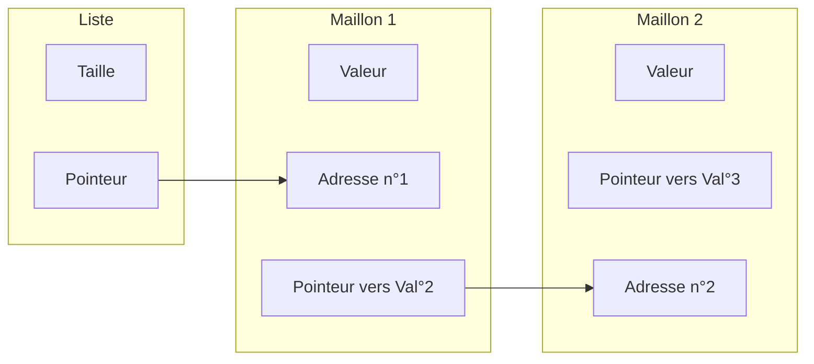
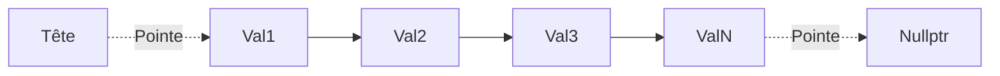

## Une liste chaînée c'est quoi ?

Une liste chaînée est une structure de donnée permettant de stocker une liste de valeur, au même titre que les [[1.13.1 Les tableaux|tableaux]]. Cependant elles permettent de par leur nature d'allouer de de désallouer de l'espace mémoire afin de changer leur taille, et ainsi avoir une taille dynamique.

Une liste chaînée est composée de deux choses, d'une variable contenant la taille de la liste, et d'un pointeur, qui va référer à l'adresse mémoire du premier élément de la liste. 
Chaque élement de la liste contient sa propre valeur, ainsi qu'un pointeur vers le prochain élément de la liste. Cette notion pourrait alors se représenter ainsi : 



La liste chainée peut donc être imaginée telle une chaîne, ou chaque maillon est lié au prochain. La liste chainée commence par un maillon appelé la tête ou le sommet. Cependant afin de rendre la chaine utilisable, on doit attribuer une adresse pour le pointeur du dernier élément de la liste. Celui-ci va donc pointer vers une adresse mémoire par défaut : `nullptr`.

La représentation simplifiée de la chaîne correspondrait alors à ceci  :




Nous allons donc voir comment créer cette structure de donnée, avec un sens de parcours unique, et un sens de parcours double.

## Les listes chaînées (sens unique)

#### Liste chainée simple : définition par des structures

```cpp
struct Element {
	int valeur = 0;
	Element *suivant = nullptr; 
}

struct Liste {
	int taille = 0;
	Element *sommet = nullptr; 
}
```

On définit premièrement une structure LinkedList qui comporte la taille de la liste chaînée, définie de base à `0` (elle est initialisée comme étant vide), et dispose d'un pointeur vers le premier élément (la tête). Le pointeur est initialisé à une adresse par défaut : `nullptr` afin d'éviter d'intéragir avec une valeur aléatoire dans la mémoire vive.

## Les listes doublement-chaînées (double sens) 

#### Liste doublement-chainée : définition par des structures

```cpp
struct Element {
	int valeur = 0;
	Element *suivant = nullptr;
	Element *precedent = nullptr;
}

struct Liste {
	int taille = 0;
	Element *sommet = nullptr; 
}
```

**Cours à voir :**
- [[3.2 Les piles]]
- [[3.3 Les files]]