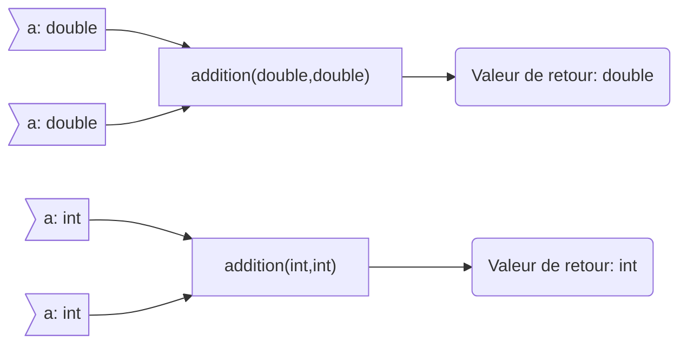

**Cours liés :**
- [[2.1. Les fonctions en général]]
- [[2.2. Les signatures de fonction (prototypes)]]

La surcharge de fonction est un concept en C++ qui permet de déclarer plusieurs fonctions avec le même nom, mais avec des signatures de fonction différentes. Une signature de fonction est la combinaison du nom de la fonction, du type de retour et de la liste de paramètres.

Prenons comme exemple une fonction addition qui pourrait traiter des `int` ou des `double` :

En mathématique, la fonction $addition(a,b)$ serait définie de $\mathbb{Z}^2 \rightarrow \mathbb{Z}$ 
Mais elle serait aussi définie de $\mathbb{R}^2 \rightarrow \mathbb{R}$ avec la même opération : 
$$
\begin{matrix}
	&\mathbb{Z}^2     &\rightarrow  &\mathbb{Z}\\
	&\mathbb{R}^2     &\rightarrow  &\mathbb{R}\\
	&addition(a,b)  & =           &a+b       \\
\end{matrix}
$$

Ou pour les plus rigoureux d'entre nous : 
$$
\begin{matrix}
	&\forall{a}\in\mathbb{Z},\forall{b}\in\mathbb{Z} : (a,b) = \mathbb{Z}^2     &\rightarrow  &\mathbb{Z} \\
	
	&\forall{a}\in\mathbb{R},\forall{b}\in\mathbb{R} : (a,b) = \mathbb{R}^2     &\rightarrow  &\mathbb{R} \\
	
	&addition(a,b)  & =           &a+b       \\
\end{matrix}
$$

Le type du résultat dépendrait alors du type des valeurs en entrée : 



Voici comment déclarer et utiliser la surcharge de fonction en C++:

```cpp
#include <iostream>

// Déclaration de la première fonction
int addition(int a, int b) 
{
	return a + b;
}

// Déclaration de la seconde fonction
double addition(double a, double b) 
{
	return a + b;
}

int main() 
{
	// Appel de la première fonction
	int result1 = addition(10, 20);
	std::cout << result1 << std::endl; // affiche 30
	
	// Appel de la seconde fonction
	double result2 = addition(10.5, 20.5);
	std::cout << result2 << std::endl; // affiche 31
	
	return 0;
}
```

Il est également possible de déclarer une fonction avec une signature qui utilise des pointeurs ou des références. Par exemple :

```cpp
void swap(int *x, int *y)
{
	int temp = *x;
	*x = *y;
	*y = temp;
}

void swap(int &x, int &y)
{
	int temp = x;
	x = y;
	y = temp;
}
```

Dans cet exemple, nous avons déclaré deux versions de la fonction `swap`, chacune avec une signature différente. La première prend deux pointeurs vers des entiers en argument et échange les valeurs auxquelles ils pointent. La seconde prend deux références vers des entiers en argument et échange les valeurs des entiers eux-mêmes.

En utilisant les signatures de fonctions, vous pouvez déclarer et utiliser des fonctions de manière précise et structurée en C++. Elles vous permettent également de créer des surcharges de fonction pour définir plusieurs versions d'une fonction qui peuvent être appelées en fonction des arguments passés.