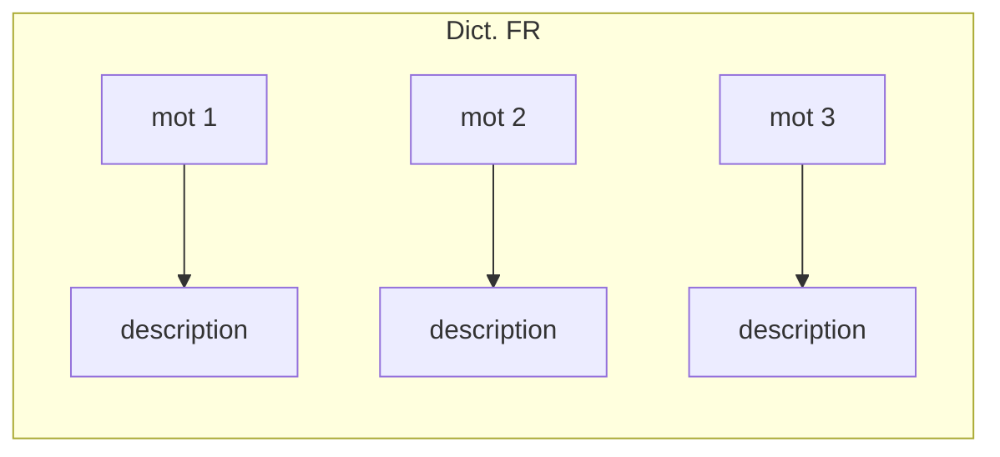
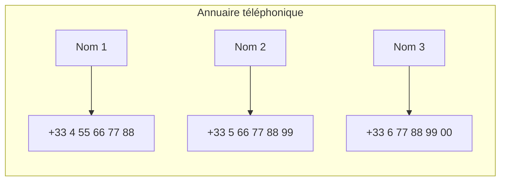

Les types conteneurs de la librarie standard sont tous répartis en 3 grands groupes, mais diposent tous de certaines fonctions. 

>[!caution] Fonctions présentes dans tous les conteneurs
> `#begin()` permet d'obtenir l'itérateur placé sur le premier élément du conteneur (il s'agit d'un pointeur intelligent que l'on peut incrémenter)
> `#end()` permet d'obtenir l'itérateur placé sur le dernier élément du conteneur, attention, ce pointeur pointe sur l'adresse **après** le dernier élément.
> `#size()` permet d'obtenir le nombre entier correspondant au nombre d'éléments dans le conteneur

## Les conteneurs de séquence : 
--- 

### Les [[1.13.2 Les vecteurs|tableaux dynamiques]] ( [vectors](https://cplusplus.com/reference/vector/vector/) )

### Les files à double sens ( [deque](https://cplusplus.com/reference/deque/deque/) )

Les files à double sens, comme leur nom l'indique, permettent d'intéragir avec elles des deux "côtés".
On peut **enfiler, défiler** avec **la tête de file ou la fin de file**, comme bon nous semble. 
Sa taille s'ajuste au même titre que pour un vecteur ou un tableau généré dynamiquement.

Le schéma d'une `deque` peut être représenté ainsi :
$$
\boxed{Element} \rightleftharpoons \boxed{head}\boxed{1}\boxed{2}\boxed{3}\boxed{4}\boxed{5}\boxed{6}\boxed{7}\boxed{8}\boxed{9}\boxed{end} \rightleftharpoons \boxed{Element}
$$
Elles s'instancient de la façon suivante : 

##### Instanciation d'une `deque`:

Pour instancier une deque, nous devons préciser un type de valeur étant donné qu'il s'agit d'une classe **générique**. La syntaxe générale est la suivante : 
```cpp
std::deque<type> var = std::deque<type>();
```

Pour faire une deque d'ints, on écrirait alors : 
```cpp
std::deque<int> intDeque = std::deque<int>();
```

##### Fonctions d'une `deque` :

Elles disposent des fonctions principales suivantes : 

>[!important] Fonctions importantes des `deque`:
> - `std::deque#push_back( ... )` qui va permettre d'ajouter un élément à la fin de la `deque`
> - `std::deque#push_front( ... )` qui va permettre d'ajouter un élément au début de la `deque`
> - `std::deque#pop_back( ... )` qui va permettre de retirer un élément à la fin de la `queue`
> - `std::deque#pop_front( ... )` qui va permettre de retirer un élémént au début de la `queue`
> - `std::deque#front()` qui va renvoyer la valeur de la tête de la `queue`
> - `std::deque#back()` qui va renvoyer la valeur de la fin de la `queue`

### Les listes ( [list](https://cplusplus.com/reference/list/list/) )

Les listes sont des types de conteneurs semblabes aux `deque`, elles sont **ordonnées et dynamiques**, mais elles permettent des intéractions supplémentaires par rapport aux deques :

##### Instaciation d'une liste

Pour instancier une liste, nous devons préciser un type de valeur étant donné qu'il s'agit d'une classe **générique**. La syntaxe générale est la suivante : 
```cpp
std::list<type> var = std::list<type>();
```

Pour faire une liste d'ints, on écrirait alors : 
```cpp
std::list<int> intList = std::list<int>();
```

##### Fonctions principales d'une liste

>[!important] Fonctions importantes de `list` : 
>- **Toutes les fonctions importantes du type `deque`**
>- `std::list#insert( ... )` permet d'insérer une valeur à un indice donné
>- `std::list#erase( ... )` permet d'effacer un élémént à *une* position ou *un intervalle* de positions
>- `std::list#swap( ... )` permet d'échanger le contenu d'une liste avec une autre liste
>- `std::list#clear()` permet de vider la liste de ses éléments

## Les conteneurs associatifs : 
--- 

### Les ensembles ( [set](https://cplusplus.com/reference/set/set/) )

Un `set` est, comme en mathématiques, un ensemble de d'éléments (sans duplicata). Il peut stocker n'importe quel type de valeurs et va empêcher l'ajout de valeurs déjà présentes.

##### Instanciation d'un set

Pour instancier un `set`, nous devons préciser un type de valeur étant donné qu'il s'agit d'une classe **générique**. La syntaxe générale est la suivante : 
```cpp
std::set<type> var = std::set<type>();
```

Pour faire une deque d'ints, on écrirait alors : 
```cpp
std::set<int> intSet = std::set<int>();
```

### Les tables ( map )

Une `map` est un système d'association clé->valeur qui, via une clé va permettre d'accéder à une valeur. Un bon exemple de `map` serait de parler des dictionnaires de langues, ou encore des annuaires téléphoniques.

Exemples avec un dictionnaire français ou chaque mot est la clé qui permet d'accéder à la description du mot et un annuaire téléphonique




##### Instanciation d'une map

Pour instancier une map, nous devons préciser deux types de valeur étant donné qu'il s'agit d'une classe **générique**. La syntaxe générale est la suivante : 
```cpp
std::map<type, type> var = std::map<type, type>();
```

Pour reprendre l'exemple ci-dessus pour l'annuaire téléphonique, on écrirait alors : 
```cpp
std::map<std::string, int> annuaire = std::map<std::string, int>();
```

##### Les fonctions importantes d'une map 

Les maps sont essentielles lors de la rédaction de certains programmes, voici les fonctions les plus importantes qu'apporte le type map : 

>[!important] Fonctions importantes de `map` : 
>- `std::map#emplace( ... )` permet d'insérer un couple clé-valeur dans la table
>- `std::map#find( ... )` permet de récupérer le couple clé-valeur situé dans la table, correspondant à la clé indiquée

## Les conteneurs dérivés : 
--- 

### Les piles ( stack )

Les piles de la librairie standard sont un type de conteneur fonctionnant suivant le même principe que [[3.2 Les piles|les piles]] vues précédemment.

##### Instanciation d'une pile : 

```cpp
std::stack<type> var = std::stack<type>();
```

Exemple avec une pile d'ints :

```cpp
std::stack<int> intStack = std::stack<int>();
```

##### Fonctions des piles

Les piles de la librairie standard disposent des fonctions que nous avons vu lors de l'étude des piles, à savoir :

>[!important] Fonctions des piles
>- `std::stack#top()` qui permet d'obtenir la valeur de la tête de la pile
>- `std::stack#pop()` qui permet de retirer la valeur en tête de la pile
>- `std::stack#push(...)` qui permet de placer une valeur à la tête de la pile
>- `std::stack#swap(...)` qui permet d'échanger le contenu d'une stack avec le contenu d'une autre stack

### Les files ( queue )

Les files de la librairie standard sont un type de conteneur fonctionnant suivant le même principe que [[3.3 Les files|les files]] vues précédemment.

##### Instanciation d'une file : 

```cpp
std::queue<type> var = std::queue<pile>();
```

Exemple avec une file d'ints :

```cpp
std::queue<int> intStack = std::queue<int>();
```

##### Fonctions des files

Les piles de la librairie standard disposent des fonctions que nous avons vu lors de l'étude des piles, à savoir :

>[!important] Fonctions des files
>- `std::queue#front()` qui permet d'obtenir la valeur de la tête de la pile
>- `std::queue#back()` qui permet d'obtenir la valeur de la fin de la pile
>- `std::queue#pop()` qui permet de retirer la valeur en tête de la pile
>- `std::queue#push(...)` qui permet de placer une valeur à la fin de la pile
>- `std::queue#swap(...)` qui permet d'échanger le contenu d'une queue avec le contenu d'une autre queue
