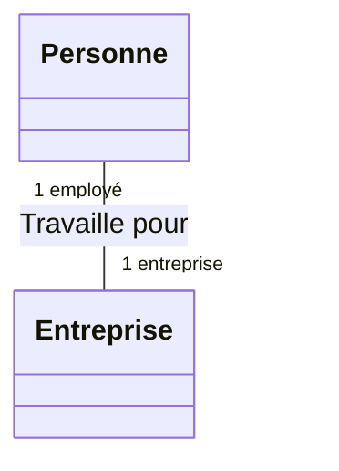
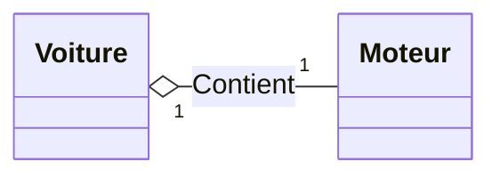
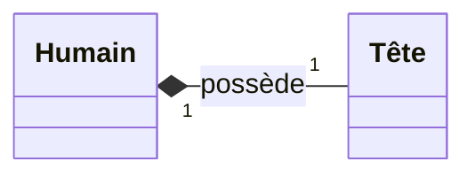

Une association de classes définit une relation entre des classes, elles diposent d'un lien entre leurs instances par le biais d'un attribut, situé dans une des deux classes.

### Association

Il s'agit d'une relation entre pairs 

### Agrégation

Il s'agit d'une inclusion d'un élément dans un ensemble est représentée par un losange vide au bout de lu lien

### Composition

Il y a contenance entre les instances :

> La destruction de l'objet composite implique la destruction des composants.

**Cours à voir :**
- [[3.2 Navigabilité]]