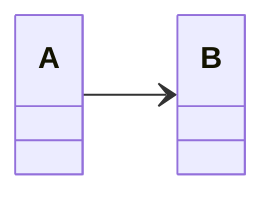

La navigabilité entre les instances indique quelles classes "connaissent" d'autres classes : 

Dans l'exemple suivant, A connait B mais l'inverse n'est pas vrai : 

**Cours à voir :**
- [[3.3 Association unidirectionnelle]]