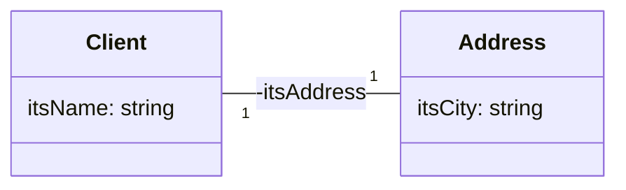

- Dans le diagramme ci-dessus, on observe que la class `Client` possède un attribut privé `itsAddress` de type `Address*`.

- L'attribut `itsAddress` est initialisé par la classe `Client`

- L'objet `itsAddress` doit exister (être instanciée) avant que le client soit instancié.

**Cours à voir :**
- [[3.4 Agrégations]]