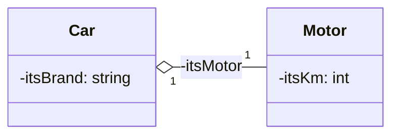

### Diagramme



- Un attribut privé `itsMotor` de type `Motor *` dans la classe `Car`
- Implémentation comme pour l’association unidirectionnelle simple

### Implémentation

```cpp
class Car { 
	private: 
		std::string itsBrand; 
		// A private attribute 
		Motor * itsMotor; 
	public: 
		// Initialisation of itsMotor by the constructeur 
		Car(std::string brand, Moteur * motor ); }; 
```

```cpp
Car::Car(std::string brand, Motor * motor) :itsBrand(brand), itsMotor(motor) { }
```

**Cours à voir :**
- [[3.5 Compositions]]