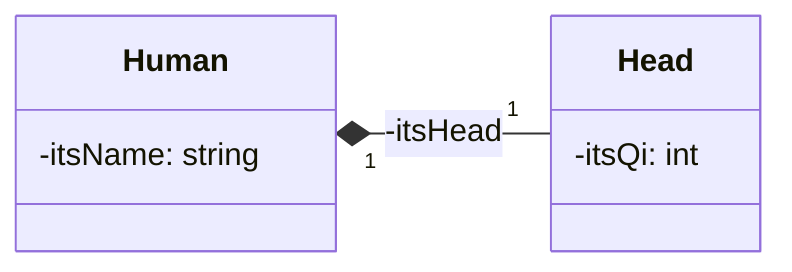

### Diagramme



- Un attribut privé `itsHead` de type `Head *` dans la classe `Human`
- Construction de l’objet `itsHead` dans le constructeur `Human`
- Suppression de l’objet `itsHead` par le destructeur `˜Human`

### Implémentation

```cpp
class Human { 
	private: 
		std::string itsName; // A private attribute 
		Head * Head * itsHead; 
	public: 
		Humain(std::string name, int qi); ~Humain(); 
};
```

```cpp
// Construction of the object itsHead by the constructor 
Human::Human(std::string name, int qi ):itsName(name) { 
	itsHead = new Head(qi) ; 
} 
// Deletion of the object itsHead by the destructor 
Human::~Human() { 
	delete itsHead; 
}
```

**Cours à voir :**
- [[3.6 Multiplicité]]