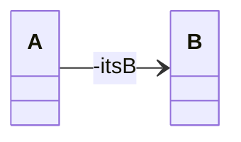
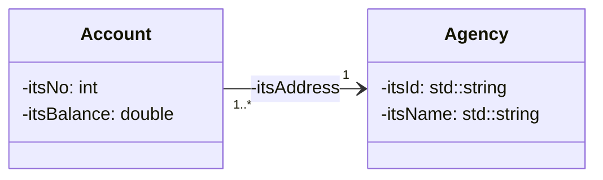
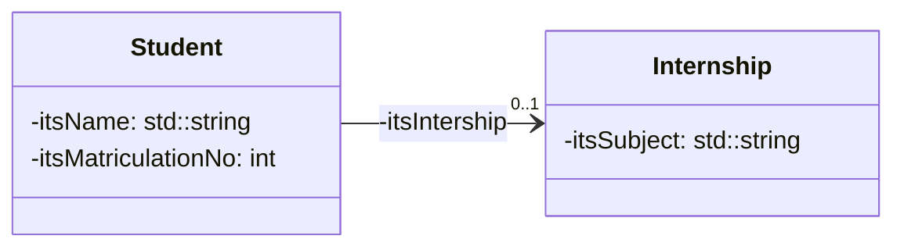

>[!important] 
>- Un attribut privé itsB de type `B *` dans la classe `A` 
> 
> - Association unidirectionnelle/ agrégation :
> 	- initialisation de itsB par le constructeur de `A` 
>   
> - Composition : 
> 	- construction/destruction de `itsB` par le constructeur/ destructeur de `A`

---
### Multiplicité $1..^*$


Exemple de diagramme d'une association unidirectionnelle $1..^* \rightarrow 1$ :




On observera donc un attribut privé `itsAgency` de type `Agency *` dans la classe `Account` 

```cpp
class Account { 
	private: 
		int itsNo; 
		double itsBalance; 
		// A private attribute Agency * 
		Agency * itsAgency; 
	public: 
		CompteBancaire(int no, Agency * agency); 
};
```

```cpp
// Initialisation of itsAgency by the constructeur 
CompteBancaire::CompteBancaire(int no, Agence * agency): itsNo(no),itsBalance(0.0),itsAgency(agency) { 

}
```

---
### Multiplicité $0..1$

>[!important] 
>- Un attribut privé `itsB` de type `B *` dans la classe `A` qui peut prendre la valeur `NULL` 
>- Association unidirectionnelle/ agrégation : 
>	- affectation d’une valeur par le modificateur 
>- Composition : méthode pour construire/ supprimer l’objet `itsB`



Un attribut privé `itsInternship` de type `Internship *` dans la classe Student qui peut prendre la valeur `NULL`

```cpp
class Student { 
	private: 
		int itsMatriculationNo; 
		std::string itsName; 
		// A private attribute Internship * which can be NULL 
		Internship * itsInternship; 
	public: 
		Student(int matriculationNo, std::string name); 
		// Assignment of a value to itsInternship by the setter 
		void setInternship(Internship * internship); ... 
};
```

```cpp
Student::Student(int matriculationNo, std::string name)             :itsMatriculationNo(matriculationNo),itsName(name) { 
	itsInternship = nullptr; 
} 

void Student::setInternship(Internship * internship) { 
	itsInternship = internship; 
}
```

**Cours à voir :**
- [[3.7 Associations bidirectionnelles]]