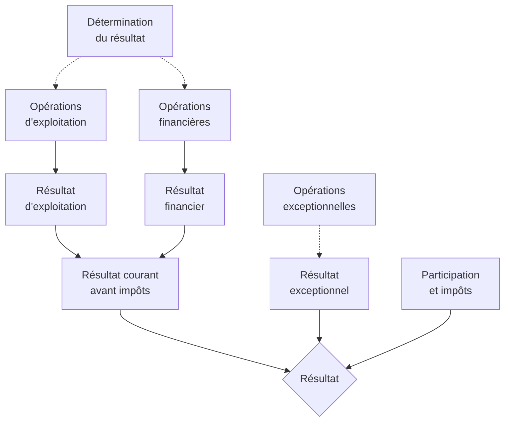

A la **différence** du **Bilan**, le **Compte de Résultat** ne présente **pas** une photographie de l’entreprise à un instant donné. 

**Il s’agit d’un document qui récapitule l’ensemble des produits et des charges rattachés à un exercice.**

Le Compte de Résultat **comptabilise les charges que l’entreprise** doit supporter effectivement et les produits dont elle a bénéficié. Il ne prend pas en compte les opérations de TVA pour lesquelles l’entreprise n’est qu’un intermédiaire entre l’Etat et le consommateur final. **Les montants figurant dans ces documents sont hors taxes.**

Le Compte de Résultat donne le résultat de l’exercice à partir de la différence entre :

$$
\text{Produits } - \text{ Charges} = \text{Résultat}
$$

Soit dans les comptes de Gestion, on s'occupera uniquement des comptes 6XX et 7XX :

Le Compte de résultat permet d'obtenir le résultat par plusieurs différences, ce qui consititue déja une ébauche d'analyse : 

On observe alors trois résultats partiels : 

$$
\text{Produits d'exploitations } - \text{ Charges d'exploitation} = \text{Résultat d'exploitations } 
$$
$$
\text{Produits financiers } - \text{ Charges financières} = \text{Résultat financier } 
$$
$$
\text{Produits exceptionnels } - \text{ Charges exceptionnelles} = \text{Résultat exceptionnels } 
$$

Le résultat de l'exercice est la synthèse de ces trois résultats partiels.

**Cours à voir :**
- [[3.1 Détail du bilan]]