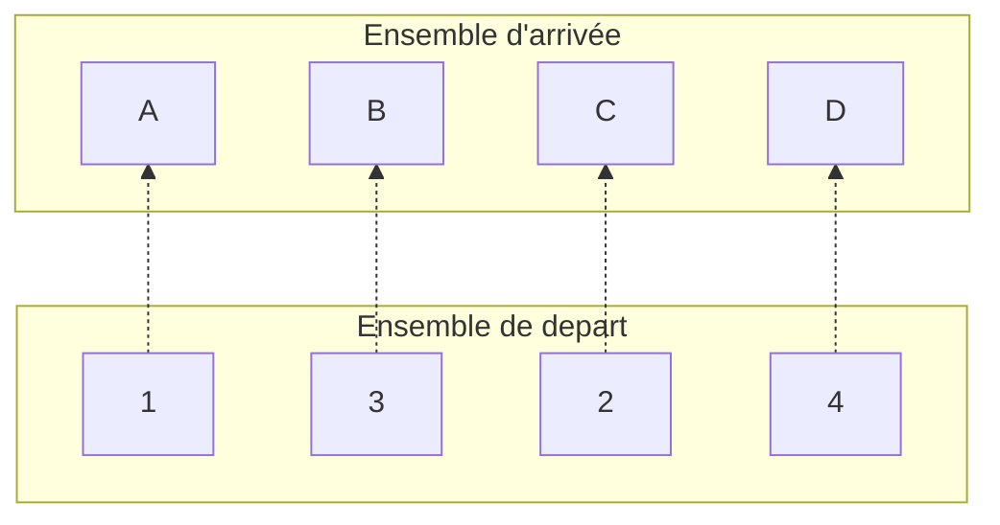

#### Application

Une apllication $f$ d'un ensemble $E$ vers $F$ est une fonction $f$ dont __le domaine de définition est $E$ tout entier__

On note $F^E$ l'ensemble des applications de $E$ vers $F$

Une application est une fonction __partout définie__
En informatique on parle de fonction __totale__ (et de fonction partielle dans le cas inverse)

>[!example] Exemple:
>Soit $id_E : E \to E$ l'application __identité__ de $E$ définie par : $f(x) : x$ pour tout $x$ appartenant à $E$ 

#### Définition d'une fonction

Un fonction entre deux ensembles peut être définie par une __formule__ indiquant les calculs à effectuer mais auussi par une __coubre__ ou un __tableau__

>[!example] Exemple :
>$f(x) = \frac{e^x2x-3}{x^5}$ est définie su $\mathbb{R^+}$
>
>$l : \mathbb{N^*_4} \to B = \{a, b, c, d\}$
>$\begin{array}{|c|c|c|c|c|} \hline x & 1 & 2 & 3 & 4 \\ \hline f(x) & a & a & b & d \\ \hline \end{array}$

>[!info] Remarque :
>Soit $E$ et $F$ deux ensembles, on appelle __correspondance__ de $E$ vers $F$ tout triplet $f = (E, F, \Gamma)$ où $\Gamma$ est une partie de $E\times F$ et est appelé le graphe de $f$

On note alors :

$Dom(f) = \{x \in E / \exists y \in F, (x, y) \in \Gamma \}$
$Im(f) = \{y \in F / \exists x \in E, (x,y) \in \Gamma \}$

>[!info] Cas Particulier :
>Si $Dom(f) = E$ alors $f$ est une application.

### Propriétés

- Une application d'un ensemble $A$ vers un ensemble $B$ qui ne prend __jamais deux fois la même valeur__ s'appelle une _injection_. On dit que l'application est ___injective___
   >[!info] 
   >l'application $f(x)$ est injective si l'égalité $f(x) = f(y)$ est possible seulement quand $x =y$

- Une application dun ensemble $A$ vers un ensemble $B$ qui prend pour __valeur tous les éléments__ de $B$ s'appelle une _surjection_. On dit que l'application est ___surjective___
   >[!info] 
   >l'application $f$ est surjective si et seulement si pour tout $y$ de $B$, il existe au moins un élément $x$ de $A$ tel que $f(x) = y$

>[!info] Remarque :
>_L'injectivité et la surjectivité_ d'une fonction ne dépandent pas seulement de la "description analytique" de la fonction mais aussi de ses ___ensembles de départ et d'arrivé___

- Une application d'un ensmeble $A$ vers un ensemble $B$ qui est à la fois __injective et surjective__ s'appelle une bijection, On dit quelle est __bijective__

### Application composée

Soient $f : A \to B$ et $g : B \to C$ deux applications.

On note $g \circ f : A \to C$ la compososition de $f$ et $g$  définie par $(g \circ f )(x) = g(f(x))$

>[!example] Exemple :
>Soit 
>
>$f(x) = ln(x)$
>$g(x) = e^x$
>
>On détermine 
>
>$(g \circ f)(x) = e^{ln(x)} = x$
>$(f \circ g)(x) = ln(e^x) = x$

>[!info] Théorème
>Si $f$ est une application __bijective__ de $A$ vers $B$,
>
>On a :
>
>$f \circ f^{-1}$ qui est l'identité de $A$
>$f^{-1} \circ f$ qui est l'identité de $B$

>[!info] Théorème:
>1. si $f$ et $g$ sont injectives, il en va de même pour $g \circ f$
>2. si $f$ et $g$ sont surjectives, il en va de même pour $g \circ f$
>3. si $f$ et $g$ sont injectives, $g ^{-1} \circ f^{-1}$ est l'application reciproque de $g \circ f$

### Suites et listes

Une __suite  finie__ est une apllication d'un l'ensemble $\mathbb{N}^*_n$ vers un ensemble $E$ qui associe à chaque entiers compris entre $1$ et $n$ un élément de $E$.

Une liste revient à écrire une suite finie de longueur $n$, en écrivant de gauche à droite les images de $1$ à $n$ séparées par des virgules et entourée par des accolades.
On obtient alors une liste d'élément de $E$.

>[!warning] Attention 
>SUITE $\neq$ LISTE

>[!example] Exemples :
>- Suite Finie :
>	$\{2,3,5,3,7\}$  représente la suite $u_n \in \mathbb{N}^*_5$ de longueur $5$ telle que $u_1 = 2$, $u_2 = 3$, $u_3 = 5$, $u_4 = 3$, $u_5 = 7$
>
>- Suite binaire de longueur $n$
>	Dans le cas où $E = \mathbb{B}$, on appelle la suite une __suite binaire de longueur $n$__
>	On supprime alors les virgules et accolades ou parenthèses,
>	Par conséquent $101001000100011100111$ est une suite binaire de longueur $21$
>
>- Suite Infinie 
>	La suite $u_n = (n + 1)^2$ définie une suite infinie par son terme général

>[!hint] Remarque :
>On peut noter une suite en extension en écrivant ses termes entre parenthèses séparés par des virgules.
>$(0,0,1,0)$ est une suite finie comportant $5$ termes
>$(0, 2, 4, 6, 8, \cdots)$ est la suite infinie des entiers pairs et positif

La suite vide est notée $()$ et est la seule suite de longueur $0$

On appel __ensemble corespondant $A(u)$__ l'ensemble des différents élément figurant dans $u$.
Par conséquent plusieurs suites distinctes peuvent avoir le même sensemble correspondant.

>[!example] Exemple :
>Les suites $(1, 2, 3)$, $(2, 1, 3)$, $(2, 3, 2, 1)$ sont deux à deux distinctes mais ont le même ensemble correspondant : $(1, 2, 3)$
