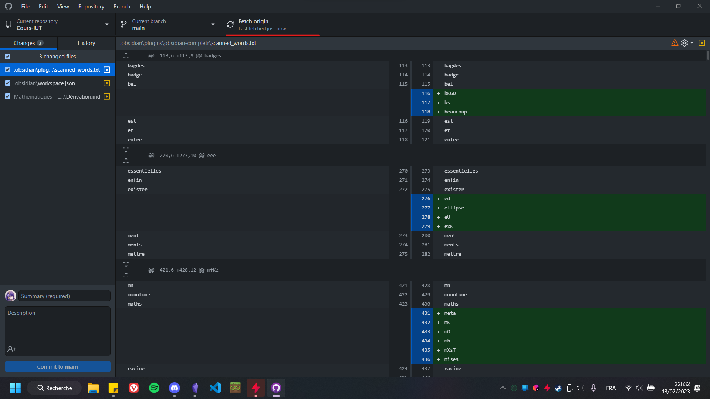

# Cours IUT

Les cours de la formation BUT Informatique

Ces cours ont été rédigés avec l'application [Obsidian](https://obsidian.md), c'est pourquoi il est préférable que vous vous en serviez pour visualiser correctement l'intégralité du cours.

## Comment accéder au cours ?

Tout d'abord il vous faudra un compte github si vous voulez recevoir facilement les mises à jour de ces cours. Ensuite, suivez simplement les instructions suivantes :

- Téléchargez [Github Desktop](https://desktop.github.com) ( va vous permettre de rendre l'actualisation des cours beaucoup plus simple )
- Une fois téléchargé, lancez et connectez vous avec vos identifiants github sur Github Desktop.
- Ceci fait, vous devriez voir ceci apparaître ceci :
  

- Vous pouvez alors choisir l'option **"Clone a repository from the Internet"**, vous diriger vers l'onglet **"URL"** et indiquez **"Altaks/Cours-IUT"** comme URL, et un dossier vide comme dossier de destination des fichiers, comme ceci :

- Une fois ceci fait, appuyez sur **"Clone"** et patientez le temps de la copie de l'intégralité des fiches de cours.
- Une fois ceci fait, ouvrez l'application Obsidian, et choisissez l'option "Ouvrir un dossier comme coffre" comme ceci :

Et choisissez le dossier racine qui contient les cours, une fois ceci fait, vous devriez voir l'arborescence des cours apparaître à gauche de votre écran. Bravo ! *oui c'est fini !*

## Récupérer les dernières mises à jour

Afin de récupérer les dernières mises à jour et obtenir les derniers cours écrits, la procédure est simple

- Ouvrez Github Desktop
- Assurez vous d'avoir sélectionné le repository **Cours-IUT**
- Appuyez sur **Fetch origin** (souligné en rouge) : 

- Si il vous indique une erreur concernant des changements locaux, appuyez sur **Stash changes** et continuez.
- Attendez que le transfert soit fini et voila, vous pouvez retourner consulter Obsidian pour lire les nouveaux cours !

L'archive contient les cours suivants :
- Archi - Début : [[1. La numération actuelle]]
- BD1 - Début : [[SQL, SGBD - C'est quoi]]
- DEV - Début : [[1.1. Les commentaires]]
- OMF - Début : [[Calculer la valeur d'un polynôme]]
- SYS - Début : [[Un shell, c'est quoi]]
- WEB - Début : [[Bases - Le web, c'est quoi]]
- MD - Début : [[Introduction au Mathématiques Discrètes]]
