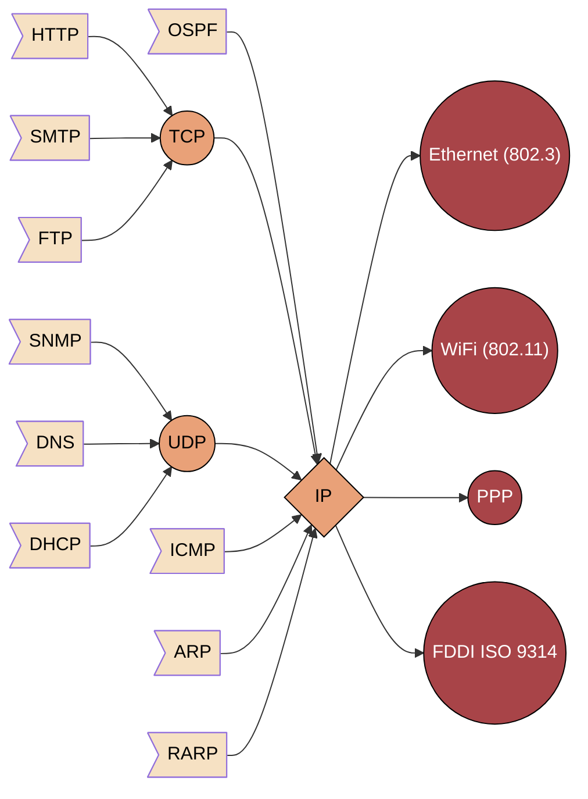

Voici un schéma de résolution des couches que vous trouverez dans un paquet en fonction du protocole de plus haut niveau qu'il a : 

```mermaid
graph LR
    HTTP>HTTP]-->TCP
    SMTP>SMTP]-->TCP
    FTP>FTP]-->TCP
    SNMP>SNMP]-->UDP
    DNS>DNS]-->UDP
    DHCP>DHCP]-->UDP
    OSPF>OSPF]-->IP{IP}
    TCP((TCP))-->IP
    UDP((UDP))-->IP
    ICMP>ICMP]-->IP
    ARP>ARP]-->IP
    RARP>RARP]-->IP
    IP-->Eth(("Ethernet (802.3)"))
    IP-->Wifi(("WiFi (802.11)"))
    IP-->PPP((PPP))
    IP-->FDDI(("FDDI ISO 9314"));
    classDef HLP fill:#F6E1C3,color:#000
    classDef MLP fill:#E9A178,color:#000,stroke:#000
    classDef LLP fill:#A84448,color:#fff,stroke:#000
    class HTTP,SMTP,FTP,SNMP,DNS,DHCP,ICMP,ARP,RARP,OSPF HLP
    class UDP,TCP,IP MLP
    class Eth,Wifi,PPP,FDDI LLP
```

**Cours liés :**
- [[2.12 Adressage dans le modèle TCP-IP]]