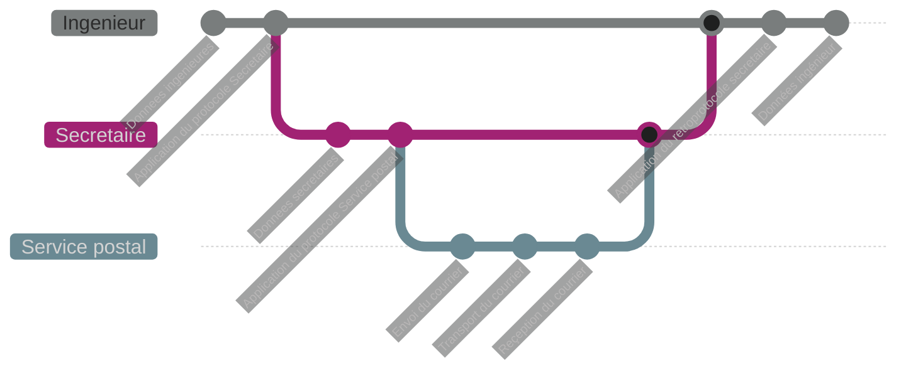

On considère 2 ingenieurs d'Alstom. 

L'un est situe en France, et l'autre en Espagne
Ils travaillent en commun en echangeant des rapports : ceci est donc leur protocole de travail.

On peut alors représenter un transport entre les couches ainsi : 

On remarque alors plusieurs couches, la couche **Ingénieure** qui s'occupe des **données utiles**, la couche Secrétaire et la couche Service postal qui eux s'occupent d'encapsuler des informations dans des protocoles définis.

**Cours liés :**
- [[2.3 Principes]]