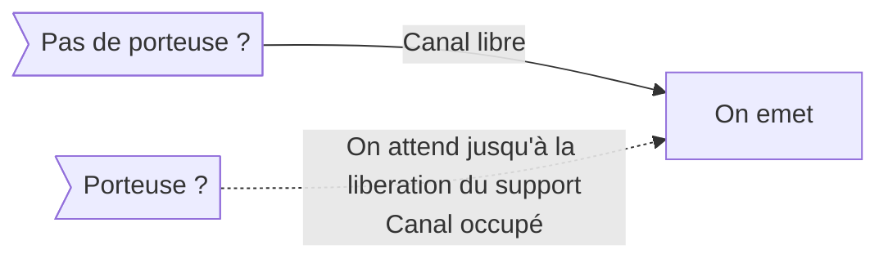
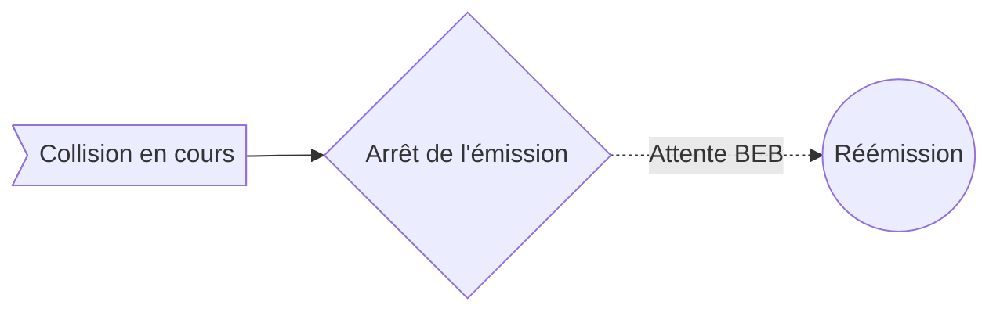

Comment ça fonctionne alors ?

### Diffusion des messages à tous les hôtes du réseau

On suit la [[1.8.3 Concepts de base (suite)|topologie]] logique dite bus, ou on envoie tous les paquets à tout le réseau. 
Ceci pose un problème, c'est à dire la collisioin de trames lors d'envois simultanés

### Principe de fonctionnement 

On écoute le bus avant d'émettre (afin d'éviter une collision avec une émission en cours) :

Si une collision est détectée par une écoute permanente du bus, c'est à dire si ce qu'on entend est différent de ce qu'on emet (en tant que machine du réseau), alors : 

Le BEB permet de déterminer le temps à attendre pour éviter une prochaine collision.