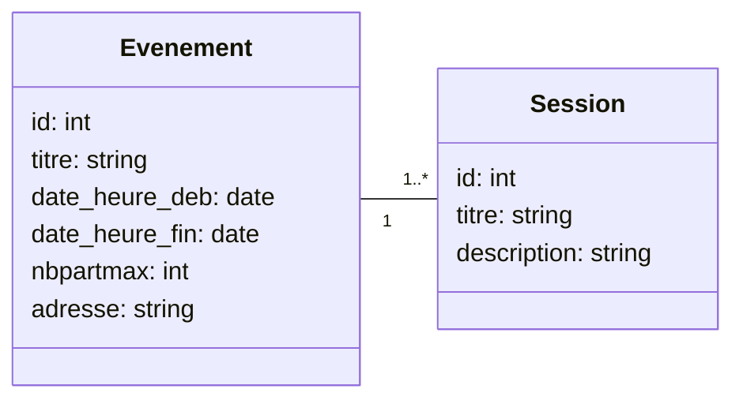

### 1. Mise en place d'une relation [[31. Doctrine - Gestion des associations entre classes|ManyToOne]]

Soit le modèle suivant : 



Ce qui se traduit par le schéma relationnel : 

```
EVENEMENT(id, titre, description, date_heure_deb, date_heure_fin, nbpartmax, adresse)

SESSION(id, titre, description, id_evenement)
```

Avec comme clés primaires `id` et comme dépendance de référence : 

```sql
ALTER SESSION ADD CONSTRAINT FK_SESSION_ID_EVENEMENT
FOREIGN KEY id_evenement REFERENCES EVENEMENT(id);
```

L’entité propriétaire est celle qui contiendrait l’attribut sur lequel portera la dépendance de référence vers l’autre entité l’autre entité. 
Notez que cet attribut `id_evenement` n’est pas dans l’entité c’est Doctrine qui va le gérer.

**Entité Propriétaire : SESSION
Entité Inverse : EVENEMENT**

Cette relation est un exemple de relation de type `ManyToOne` qui lie une entité A à
plusieurs entités B.

Ici on peut ajouter plusieurs sessions à un événement mais une session n’est liée qu’à un seul événement, mais pourra éventuellement changer d’évènement.

##### Création de l'entité `Session` avec le générateur : 

```shell  
bash-5.1# php bin/console make:entity Session
```

### Ajout de l'attribut privé `evenement` de type relation `ManyToOne`

```shell  
bash-5.1# php bin/console make:entity Session
```

Relancer cette commande va nous permettre d'ajouter des propriétés à l'entité.

On indique comme nouvelle propriété `evenement`, on choisit comme type `relation`
La classe liée est `Evenement` et le type de relation est `ManyToOne`.
La propriété `Session.evenement` ne peut pas être `null`.

On autorise `Evenement` à obtenir le/les `Session` associées (association bidirectionnelle)

On observe alors le résultat suivant : 

```
updated: src/Entity/Session.php
updated: src/Entity/Evenement.php
```

>[!warning] En cas de problème lors de la modification d'une entité
>
>Si vous voulez refaire une entité depuis le départ, retirez la classe de l'entité correspondante dans `src/Entity` et son contrôleur dans `src/Controller`.
>
>Ex : Si vous voulez refaire la classe `Evenement` , supprimez : 
>- `src/Entity/Evenement.php`
>- `src/Controller/EvenementController.php`
>  
>Une fois ceci fait, vous pouvez recréer l'entité via le CLI de Symfony (make)

### Mise à jour de la base de donnée suite à un changement de schéma d'entités

Pour changer la structure de la base de donnée et faire en sorte que Doctrine l'adapte aux nouvelles entités, vous pouvez lancer la commande : 

```shell
php bin/console make:migration
```

Vous obtiendrez un message similaire à : 

```
 created: migrations/Version20231013063841.php  
             Success!   
             
  
Review the new migration then run it with php bin/console doctrine:migrations:migrate 
See https://symfony.com/doc/current/bundles/DoctrineMigrationsBundle/index.html
```

Vous pourrez observer un fichier de migration de version dans le dossier `migrations`.

>[!done] Composition d'un fichier de Version (migration de base de données)
>
>- La méthode `up` correspond à la mise en place de la migration : 
>  ```php
> public function up(Schema $schema): void  
> {  
>    $this->addSql('CREATE TABLE evenement ...');  
>    $this->addSql('CREATE TABLE messenger_messages ...');  
> }
> ```
>  
>- La méthode `down` correspond à l'annulation de la migration : 
>
>```php
>public function down(Schema $schema): void  
>{
>	$this->addSql('DROP TABLE evenement');
>	$this->addSql('DROP TABLE messenger_messages');  
>}
>```
>
>- Il existe aussi une méthode `getDescription` qui peut être remplie par le développeur pour indiquer le détail des changements de la version, ou simplement expliquer à quoi elle sert : 
>  
> ```php
> public function getDescription(): string  
> {  
> 	return '';  
> }
> ```
> 
> - La nomenclature d'une version, le nombre bizarre après `Version` dans le nom du fichier, correspond au timestamp de la création de la migration. Il ne peut donc pas y avoir deux versions avec le même nom.

Une fois la création de la migration effectuée, vous pouvez l'exécuter ainsi : 

```shell
php bin/console doctrine:migrations:migrate
```
ou alors : 
```shell
php bin/console d:m:m # Ici on trouve un des nombreux alias de Doctrine
```

>[!danger] Migrer d'une version à une autre via Doctrine
>Les migrations de versions via Doctrine peut entraîner une perte de données si le schéma change sur des colonnes existantes. 
>
>Veuillez faire attention avec ce genre de changements !

qui donne comme résultat : 
  
```  
WARNING! You are about to execute a migration in database "iut" that could result in schema changes and data loss. Are you sure you wish to continue? (yes/no) [yes]: > yes  
[notice] Migrating up to DoctrineMigrations\Version20231013063841  
[notice] finished in 54.6ms, used 22M memory, 1 migrations executed, 2 sql queries  

[OK] Successfully migrated to version : DoctrineMigrations\Version20231013063841
```

### Modifier une route via son contrôleur : 

Une fois l'entité faite, et la version migrée sur la base de données, vous pouvez modifier le comportement des routes de Symfony (le site web donc).

>[!example] Exemple
>Modifiez l’action detailevt($id) du controlleur Evenement afin qu’elle récupère
l’événement passé en paramètre de l’URL …../detailevt/id. 
> 
> Il faut pour cela demander au repository de l’entité Evenement de retourner l’événement de l’id concerné. 
> 
> Usage de la méthode find($id) du repository.
> 
> Vous pouvez également mettre à jour la route en /detailevenement pour qu’elle
exprime mieux le sens de cette URL.

Ajout d'une méthode `detailevt` dans `src/Controller/EvenementController.php`

```php
#[Route('/detailevt/{id?}', name: 'detail_evt')]  
public function detailevt(?int $id, ManagerRegistry $doctrine): Response  
{  
    $entityManager = $doctrine->getManager();  
    $repository = $entityManager->getRepository('App\Entity\Evenement');  
    $evenement_choisi = $repository->find($id);  
	  
    $listeSessions = $evenement_choisi->getSessions();  
	  
    return $this->render('evenement/detailevt.html.twig', [  
        'evenement_choisi' => $evenement_choisi,
		'liste_sessions' => $listeSessions    
	]);  
}
```

Il se passe énormément de choses ici, premièrement l'attribut de la méthode `detailevt`:

```
#[Route('/detailevt/{id?}', name: 'detail_evt')]  
```

On voit qu'il indique que la méthode du contrôleur correspond à la route `/detailevt/` avec un `id` facultatif **(le `?` indique que la valeur peut être `null`)** après, et que cette route est connue par Symfony sous le nom de `detail_evt`.

>[!warning] Symfony n'accepte pas que deux méthodes gèrent des routes ayant le même paramètre `name` dans l'attribut `#[Route(...)]`.

>[!done] L'attribut `#[Route(...)]` supporte [plusieurs fonctionnalités](https://symfony.com/doc/current/routing.html#route-parameters) :
>- Les correspondances par expressions régulières
>- Les valeurs par défaut
>- Les priorités
>- La conversion de paramètres
>- Des paramètres spéciaux : 
>	- Choix du controller exécutant
>	- Filtrage par format de requête (Valeur de `Content-Type` dans la requête)
>	- Fragment (identification de la portion du document par les urls utilisant un `#` sur un id pour descendre directement au bon endroit)
>	- Localité, le pays/la langue de la page demandée
>- Des paramètres passés par défaut à la page renvoyée
>- Support des `/` dans les paramètres de route
>- Alias de routes (deux routes mènent au même endroit)
>- Groupes de routes, préfixes de routes

Ensuite, décomposons le code PHP lui-même : 

```php
public function detailevt(?int $id, ManagerRegistry $doctrine): Response  
{  
    $entityManager = $doctrine->getManager();
    // On récupère l'EntityManager de Doctrine
    
    $repository = $entityManager->getRepository('App\Entity\Evenement'); 
    // On récupère le repository (le dépôt de Doctrine) des entités Evenement
     
    $evenement_choisi = $repository->find($id); 
    // On récupère l'évenement demandé d'après l'id passé en paramètre 
	
    $listeSessions = $evenement_choisi->getSessions();  
	// On récupère la liste des sessions correspondates à l'évènement choisi, Doctrine s'est occupé de lier les instaces des Sessions automatiquement
	
	// On renvoie la page twig située dans `templates` avec des correspondances de valeurs.
    return $this->render('evenement/detailevt.html.twig', [  
        'evenement_choisi' => $evenement_choisi,
		'liste_sessions' => $listeSessions    
	]);  
}
```

Le fichier Twig correspondant contient : 

```twig
{# 
On inclut le fichier de base de twig pour connaître les valeurs des blocs title et body, ils sont définis dans 'base.html.twig' situé dans `templates` 
#}

  


{# 
On inclut le début du bloc titre tout en ajoutant notre nom de page, et on finit le bloc 
#}
Hello EvenementController!  

{# 
On inclut le début du bloc body et et le corps de la page

On remarque l'utilisation de evenement_choisi.titre qui est rendu accessible par le passage de paramètres du controller lors de l'appel de la méthode render(). 

Même remarque pour liste_sessions
#}
  
<style>  
    .example-wrapper { margin: 1em auto; max-width: 800px; width: 95%; font: 18px/1.5 sans-serif; }    .example-wrapper code { background: #F5F5F5; padding: 2px 6px; }</style>  
  
<div class="example-wrapper">  
    <h1>Titre : {{ evenement_choisi.titre }}</h1>  
    <h2>Nombre max participants {{ evenement_choisi.nbpartmax }}</h2>    <h2>Adresse {{ evenement_choisi.adresse }}</h2>  
            <h1> Session : {{ session.titre }} </h1>        <h2> Auteur : {{ session.nomauteur }} </h2>      
</div>  

```

### Test de la route créée :

Il suffit alors d'ajouter des valeurs dans votre base de données, et vous verrez la liste de vos sessions liées à l'évènement indiqué dans l'url entrée.